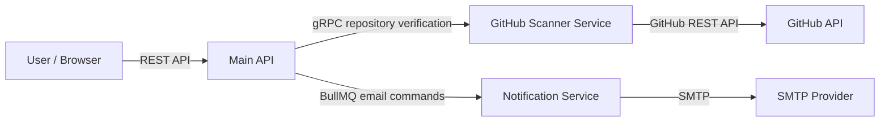
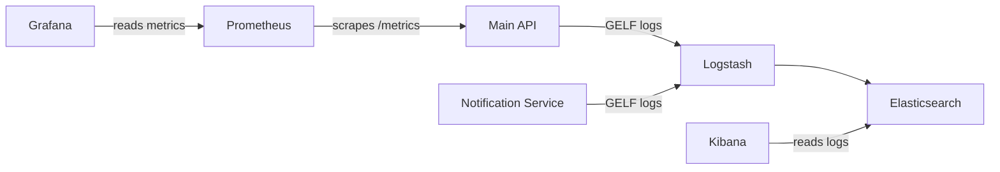
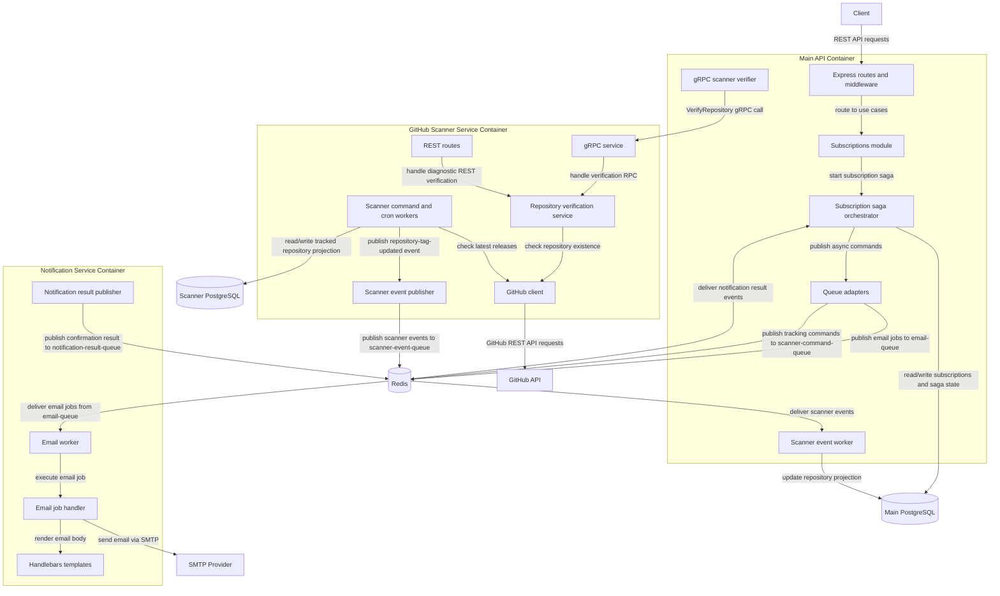
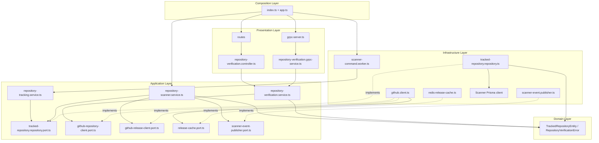
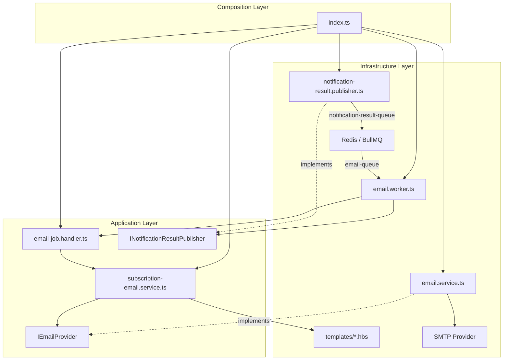
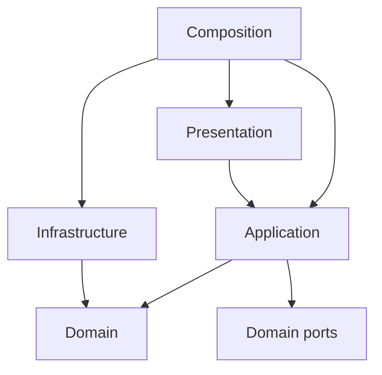

# Application Architecture

This document describes the current architecture of the GitHub Release Notification API.
It focuses on service boundaries, component responsibilities, data ownership, runtime dependencies, and the intended dependency direction inside the codebase.

For deeper reliability and flow details, see [System Design](system-design.md) and the [Architecture Decision Records](adr).

## 1. Architecture Style

The application uses a hybrid architecture:

- **Main API** is a modular monolith built with Node.js, TypeScript, Express, Prisma, PostgreSQL, Redis, and BullMQ.
- **Notification Service** is an extracted worker service responsible for email delivery.
- **GitHub Scanner Service** is an extracted service responsible for GitHub repository verification and release scanning.
- **Shared packages** contain cross-service contracts and small shared utilities.

The main design goal is to keep business decisions in the Main API while moving slow or independently scalable work, such as SMTP delivery and GitHub scanning, into separate services.

## 2. System Context

### 2.1. Core Business Context

This diagram shows how the system delivers business value by interacting with external users and third-party APIs.



| Actor/System   | Responsibility                                          |
| -------------- | ------------------------------------------------------- |
| User / Browser | Creates, confirms, lists, and cancels subscriptions.    |
| GitHub API     | Source of repository existence and latest release data. |
| SMTP Provider  | Sends confirmation and release notification emails.     |

### 2.2. Observability & Infrastructure Context

This diagram illustrates how telemetry, metrics, and logs are collected from the application services.



| Actor/System                      | Responsibility                                      |
| --------------------------------- | --------------------------------------------------- |
| Prometheus / Grafana              | Collect and visualize operational metrics.          |
| ElasticSearch / Logstash / Kibana | Collect and inspect service logs in Docker Compose. |

## 3. Container View



Runtime containers in `docker-compose.yml`:

| Container                             | Role                                                                      |
| ------------------------------------- | ------------------------------------------------------------------------- |
| `app`                                 | Main API and Main API workers.                                            |
| `notification-service`                | Email command consumer and notification result publisher.                 |
| `github-scanner-service`              | Repository verification, tracked repository projection, release scanning. |
| `db`                                  | Main API PostgreSQL database.                                             |
| `scanner_db`                          | GitHub Scanner Service PostgreSQL database.                               |
| `redis`                               | BullMQ backend and GitHub release cache.                                  |
| `prometheus`, `grafana`               | Metrics stack.                                                            |
| `elasticsearch`, `logstash`, `kibana` | Logging stack.                                                            |

## 4. Component View

### 4.1. Main API

```mermaid
flowchart TD
    subgraph Composition["Composition Layer"]
        Entry[src/index.ts]
        Containers[src/containers]
    end

    subgraph Presentation["Presentation Layer"]
        Routes[src/routes + subscription.routes.ts]
        Middleware[src/middleware]
        Controller[SubscriptionController]
    end

    subgraph Application["Application Layer"]
        SubscriptionService[SubscriptionService]
        Saga[SubscriptionSagaOrchestrator]
        Compensation[SubscriptionSagaCompensationService]
        NotificationResultHandler[NotificationResultHandler]
        ScannerEventHandler[ScannerEventHandler]
    end

    subgraph Domain["Domain Layer"]
        EmailQueuePort[IEmailQueue port]
        ScannerCommandPort[IScannerCommandPublisher port]
        RepositoryVerifierPort[IRepositoryVerifier port]
        DomainTypes[SubscriptionEntity / TrackedRepoEntity / domain errors]
    end

    subgraph Infrastructure["Infrastructure Layer"]
        NotificationResultWorker[NotificationResultWorker]
        ScannerEventWorker[ScannerEventWorker]
        SubscriptionRepository[SubscriptionRepository]
        SubscriptionQueryRepository[SubscriptionQueryRepository]
        TrackedRepoRepository[TrackedRepoRepository]
        SagaRepository[SubscriptionSagaRepository]
        EmailQueueAdapter[EmailQueueAdapter]
        ScannerCommandAdapter[ScannerCommandQueueAdapter]
        GrpcVerifier[GrpcRepositoryVerifier]
        EmailQueue[[email-queue]]
        ScannerCommandQueue[[scanner-command-queue]]
        NotificationResultQueue[[notification-result-queue]]
        ScannerEventQueue[[scanner-event-queue]]
        Prisma[(Prisma Client / Main PostgreSQL)]
        Redis[(Redis / BullMQ)]
        ScannerGrpcClient[gRPC scanner client]
    end

    Entry --> Containers
    Entry --> Routes
    Entry --> NotificationResultWorker
    Entry --> ScannerEventWorker
    Containers --> Controller
    Containers --> SubscriptionService
    Containers --> Saga
    Containers --> NotificationResultWorker
    Containers --> ScannerEventWorker
    Routes --> Middleware
    Routes --> Controller

    Controller -- "POST /subscribe" --> Saga
    Controller -- "confirm / unsubscribe / list" --> SubscriptionService

    SubscriptionService --> SubscriptionRepository
    SubscriptionService --> SubscriptionQueryRepository
    SubscriptionService --> ScannerCommandPort
    SubscriptionService --> DomainTypes

    Saga --> Prisma
    Saga --> SagaRepository
    Saga --> Compensation
    Saga --> RepositoryVerifierPort
    Saga --> EmailQueuePort
    Saga --> DomainTypes

    Compensation --> Prisma
    Compensation --> SagaRepository

    NotificationResultWorker --> Redis
    NotificationResultWorker --> NotificationResultQueue
    NotificationResultWorker --> NotificationResultHandler
    NotificationResultHandler --> SagaRepository
    NotificationResultHandler --> Compensation

    ScannerEventWorker --> Redis
    ScannerEventWorker --> ScannerEventQueue
    ScannerEventWorker --> ScannerEventHandler
    ScannerEventHandler --> TrackedRepoRepository
    ScannerEventHandler --> SubscriptionQueryRepository
    ScannerEventHandler --> EmailQueuePort
    ScannerEventHandler --> DomainTypes

    EmailQueueAdapter -. implements .-> EmailQueuePort
    EmailQueueAdapter --> EmailQueue
    ScannerCommandAdapter -. implements .-> ScannerCommandPort
    ScannerCommandAdapter --> ScannerCommandQueue
    GrpcVerifier -. implements .-> RepositoryVerifierPort
    GrpcVerifier --> ScannerGrpcClient

    EmailQueue --> Redis
    ScannerCommandQueue --> Redis
    NotificationResultQueue --> Redis
    ScannerEventQueue --> Redis

    SubscriptionRepository --> Prisma
    SubscriptionQueryRepository --> Prisma
    TrackedRepoRepository --> Prisma
    SagaRepository --> Prisma
```



Main API responsibilities:

- Owns subscription lifecycle: `PENDING`, `ACTIVE`, `UNSUBSCRIBED`.
- Owns the subscription Saga and compensation logic.
- Owns the main read/write model for subscriptions and repositories.
- Publishes email commands and scanner synchronization commands.
- Consumes notification result events and scanner events.
- Exposes the public REST API and operational endpoints.

This diagram reflects the current implementation, not only the intended layer direction. Two important implementation details are:

- `SubscriptionController` delegates `POST /subscribe` directly to `SubscriptionSagaOrchestrator`; `SubscriptionService` handles confirm, unsubscribe, and query operations.
- `SubscriptionSagaOrchestrator` and `SubscriptionSagaCompensationService` currently use `PrismaClient` directly for transactional subscription creation and compensation. Other subscription read/write operations go through repository classes.

### 4.2. GitHub Scanner Service



GitHub Scanner Service responsibilities:

- Verifies repository existence for the Main API through gRPC.
- Keeps its own tracked repository projection.
- Periodically checks GitHub releases.
- Uses Redis cache to reduce GitHub API calls.
- Publishes release events to `scanner-event-queue`.

### 4.3. Notification Service



Notification Service responsibilities:

- Consumes email commands.
- Renders confirmation and release notification templates.
- Sends emails through SMTP.
- Publishes success or failure result events for confirmation email delivery.
- Does not modify Main API database state directly.

## 5. Layering

The codebase follows a pragmatic layered architecture. The current folder structure does not use one global `domain/application/infrastructure` tree for every service, but the dependency direction is still explicit.

### 5.1. Main API Layers

| Layer          | Paths                                                                                                                                | Responsibility                                                       |
| -------------- | ------------------------------------------------------------------------------------------------------------------------------------ | -------------------------------------------------------------------- |
| Presentation   | `src/routes`, `src/middleware`, `src/modules/*/*.controller.ts`, `src/modules/*/*.routes.ts`, `src/modules/*/*.schema.ts`            | HTTP routing, validation, auth, request/response mapping.            |
| Application    | `src/modules/*/*.service.ts`, `src/modules/*/saga`, `src/modules/scanner/*handler.ts`                                                | Use cases, Saga orchestration, event handling.                       |
| Domain         | `src/modules/*/*.entity.ts`, `src/modules/github/*.port.ts`, `src/queue/**/*.port.ts`, `src/shared/errors.ts`                        | Business types, domain errors, and ports.                            |
| Infrastructure | `src/infrastructure`, `src/queue/**/*adapter.ts`, `src/queue/**/*.queue.ts`, `src/modules/**/*worker.ts`, repository implementations | Prisma, Redis, BullMQ, workers, gRPC/REST clients, Swagger, metrics. |
| Composition    | `src/containers`, `src/index.ts`                                                                                                     | Dependency wiring and process startup.                               |

Allowed dependency direction:



Main API rules:

- Controllers and routes may call application services.
- Application services may depend on domain entities and ports.
- Application services should not depend directly on Express, Prisma client construction, BullMQ queue construction, SMTP, or concrete gRPC setup.
- Infrastructure adapters may depend on domain ports and implement them.
- Composition code may import any layer because it wires dependencies together.

### 5.2. GitHub Scanner Service Layers

| Layer          | Paths                                                               | Responsibility                                                                |
| -------------- | ------------------------------------------------------------------- | ----------------------------------------------------------------------------- |
| Presentation   | `services/github-scanner-service/src/routes`, `controllers`, `grpc` | REST/gRPC transport and request mapping.                                      |
| Application    | `services/github-scanner-service/src/app`                           | Repository verification, tracking, scanning use cases and ports.              |
| Domain         | `services/github-scanner-service/src/domain`                        | Scanner domain entities and errors.                                           |
| Infrastructure | `github`, `cache`, `repositories`, `publishers`, `db`, `workers`    | GitHub API client, Redis cache, Prisma repository, BullMQ publisher/consumer. |
| Composition    | `app.ts`, `index.ts`                                                | Service wiring and startup.                                                   |

Scanner rules:

- `app` services define use cases and depend on ports.
- `domain` must stay independent from Express, gRPC, Prisma, Redis, BullMQ, and Axios.
- Transport adapters convert HTTP/gRPC-specific errors to application/domain errors and back.
- Infrastructure implements ports and performs external I/O.

### 5.3. Notification Service Layers

| Layer          | Paths                                                                                  | Responsibility                                               |
| -------------- | -------------------------------------------------------------------------------------- | ------------------------------------------------------------ |
| Application    | `email-job.handler.ts`, `subscription-email.service.ts`                                | Email use cases and template selection.                      |
| Infrastructure | `email.service.ts`, `email.worker.ts`, `notification-result.publisher.ts`, `templates` | SMTP, BullMQ worker, BullMQ publisher, Handlebars templates. |
| Composition    | `index.ts`                                                                             | Worker startup and dependency wiring.                        |

Notification rules:

- Notification Service receives commands through shared contracts.
- It never imports Main API modules or writes to Main API database tables.
- It reports confirmation email outcomes only through `notification-result-queue`.

## 6. Shared Contracts

Shared contracts are isolated in workspace packages:

| Package                                   | Purpose                                                                                         |
| ----------------------------------------- | ----------------------------------------------------------------------------------------------- |
| `@github-notifier/notification-contracts` | Email job payloads, notification result event payloads, queue names.                            |
| `@github-notifier/scanner-contracts`      | Scanner command/event payloads, queue names, generated gRPC TypeScript contracts.               |
| `@github-notifier/shared`                 | Small shared utilities such as logger, environment helpers, and GitHub repository name parsing. |

The `.proto` file is the source of truth for gRPC repository verification:

```txt
proto/github/notifier/scanner/v1/repository_verification.proto
```

## 7. Architecture Test Targets

Architecture tests for this codebase verify that:

- Domain files do not import infrastructure frameworks such as Express, Prisma, BullMQ, Redis, Axios, Nodemailer, or gRPC.
- Main API use cases do not import Express transport code.
- Main API infrastructure does not import presentation files.
- GitHub Scanner Service application code does not import transport or adapter code.
- Notification Service does not import implementation code from the Main API or GitHub Scanner Service.
- GitHub Scanner Service implementation remains independent from the Main API and Notification Service implementation.
- Shared packages do not import application or service implementation code.

## 8. Related Documents

- [System Design](system-design.md)
- [ADR-001: Use PostgreSQL for Database](adr/0001-use-postgresql-for-database.md)
- [ADR-002: Use Redis for Job Queues](adr/0002-use-redis-for-job-queues.md)
- [ADR-004: Extract Notification Service](adr/0004-extract-notification-service.md)
- [ADR-005: Use BullMQ and Redis as Message Broker](adr/0005-use-bullmq-redis-as-message-broker.md)
- [ADR-006: Use Orchestrated Saga for Subscription Flow](adr/0006-use-orchestrated-saga-for-subscription-flow.md)
- [ADR-007: Use gRPC for Repository Verification](adr/0007-use-grpc-for-repository-verification.md)
