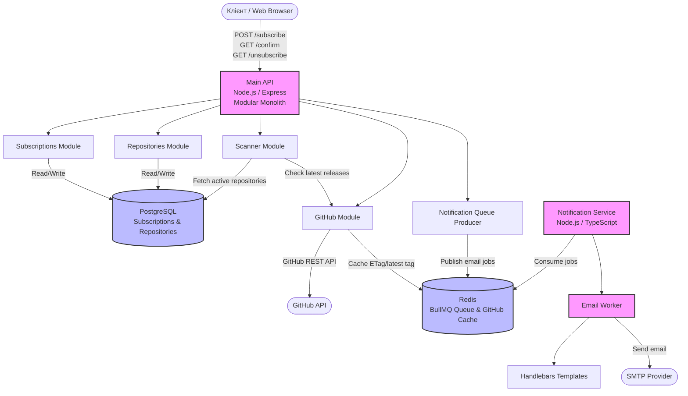
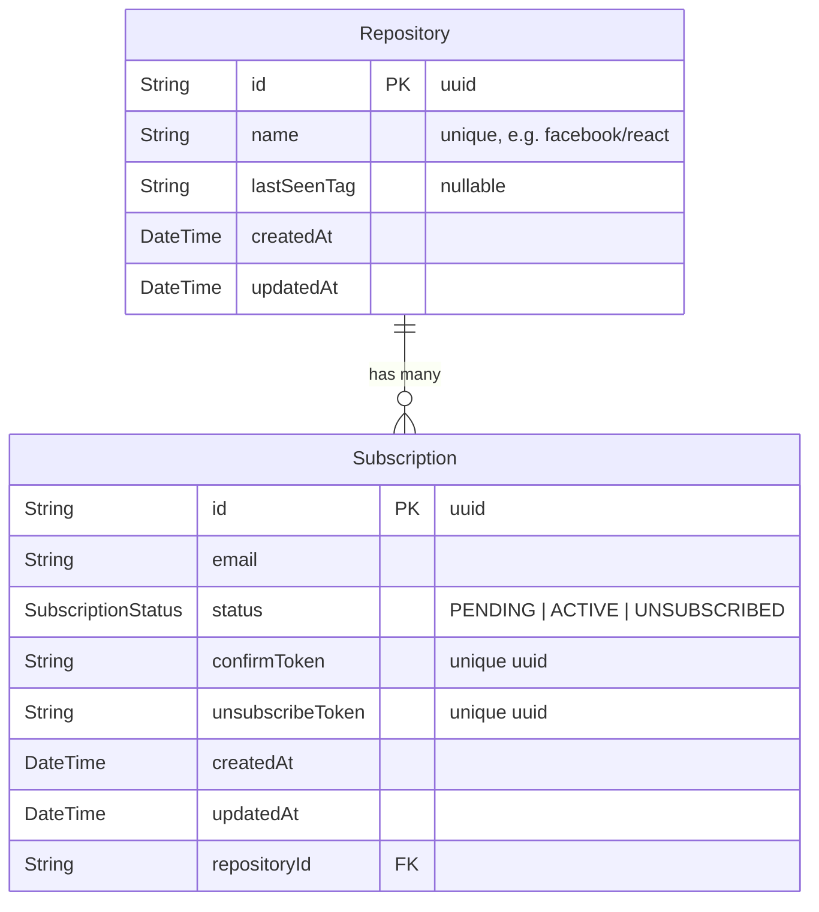

# System Design: GitHub Release Notification API

## 1. Вимоги системи

### Функціональні вимоги

- Користувачі можуть підписатися на оновлення конкретного відкритого репозиторію на GitHub (наприклад, `facebook/react`).
- Система використовує механізм підтвердження email через унікальний токен для запобігання спаму.
- Користувач може відписатися від сповіщень через спеціальне посилання в листі.
- Система автоматично моніторить нові релізи у вказаних репозиторіях і надсилає email-сповіщення підписникам.

### Нефункціональні вимоги

- **Надійність:** Жодне сповіщення про реліз не має бути втрачено.
- **Швидкодія API:** Latency для клієнтських запитів (subscribe/unsubscribe) < 200ms.
- **Масштабованість:** Можливість легкого горизонтального масштабування воркерів розсилки.

### Обмеження

- **GitHub API Rate Limits:** 60 запитів/годину для неавтентифікованих запитів, або 5000 запитів/годину з токеном.

---

## 2. Оцінка навантаження

Для оцінки візьмемо гіпотетичну базу у **10,000 активних підписок**.

### Трафік

- **Запити до нашого API:** ~100-200 запитів на день. Навантаження мінімальне.
- **Запити до GitHub API:** Якщо ми маємо 1000 унікальних репозиторіїв у базі і перевіряємо їх кожні 10 хвилин: `1000 * (60/10) * 24 = 144,000 запитів/день` (або 6,000 запитів/годину).

  > Оскільки 99% запитів не будуть знаходити кожен раз нові релізи, вони не будуть списуватися з ліміту GitHub, що дозволяє системі стабільно працювати навіть при такому навантаженні. Якщо реліз не змінився, GitHub просто повертає `304 Not Modified` і такі запити не списуються з ліміту.

- **Відправка Email:** ~200-500 листів на день.

### Дані

- **Розмір запису підписки (PostgreSQL):** ~200 Bytes.
- **Загальний розмір БД:** 10,000 записів × 200 B = ~2 MB.
- **Redis Cache:** Кешування останніх відповідей GitHub API займе до 10-20 MB.

---

## 3. High-Level Архітектура

Cистема побудована як **модульний моноліт + окремий Notification Service**.

Основний застосунок залишається монолітом, але всередині має чітко розділені модулі:

- **Subscriptions Module** — створення, підтвердження, скасування та перегляд підписок.
- **Repositories Module** — робота з відстежуваними GitHub-репозиторіями.
- **Scanner Module** — періодична перевірка нових релізів.
- **GitHub Module** — інтеграція з GitHub API та кешування відповідей.
- **Notifications Module** — контракт задач для черги сповіщень.
- **Infrastructure Layer** — PostgreSQL, Redis, logger, metrics, Swagger.

Домен email-сповіщень винесено в окремий мікросервіс:

- **Notification Service** — окремий сервіс, який споживає задачі з Redis/BullMQ, рендерить Handlebars-шаблони та відправляє email через SMTP.



### Межа між модулями та мікросервісом

Основний API більше не має прямої залежності від Nodemailer, SMTP або email-шаблонів. Він лише створює задачі в Redis/BullMQ:

```txt
confirm-subscription
new-release
```

Notification Service є власником усієї email-логіки:

- вибір шаблону;
- рендеринг HTML;
- інтеграція з SMTP;
- retry-логіка через BullMQ worker.

Такий підхід дозволяє масштабувати розсилку незалежно від API та зменшує відповідальність основного застосунку.

---

## 4. Детальний дизайн компонентів

### 4.1. API Service

Відповідає за REST-комунікацію з користувачами.

- **Стек:** Node.js, Express, Zod.
- Ендпоінти не виконують важкої роботи. При запиті на підписку API створює запис у БД зі статусом `status: PENDING` і миттєво віддає задачу на відправку листа підтвердження у Redis-чергу.

### 4.2. GitHub Scanner (Worker)

- Запускається періодично (через `node-cron` кожні 10 хвилин).
- Дістає з БД список унікальних репозиторіїв, на які є хоча б одна активна підписка (`status: ACTIVE`).
- Робить запит до GitHub API (`GET /repos/{owner}/{repo}/releases/latest`).
- Порівнює отриманий тег із `lastSeenTag` у таблиці `Repository`.
- Якщо є новий реліз:
  - Оновлює `lastSeenTag` у БД.
  - Знаходить всіх користувачів, підписаних на цей репозиторій.
  - Створює задачі у Redis черзі на відправку сповіщень для кожного користувача.

### 4.3. Message Queue & Email Worker

Використання Redis і BullMQ дозволяє:

- Розподілити навантаження при масовій розсилці.
- Автоматично повторювати спроби відправки у разі тимчасової недоступності SMTP-сервера.

---

## 5. Схема Бази Даних

База даних нормалізована і розділена на дві таблиці: `Repository` зберігає унікальні репозиторії та стан моніторингу, `Subscription` — підписки користувачів із їхнім статусом.



**Enum `SubscriptionStatus`:**

| Значення       | Опис                                              |
| -------------- | ------------------------------------------------- |
| `PENDING`      | Підписка створена, email ще не підтверджено       |
| `ACTIVE`       | Email підтверджено, користувач отримує сповіщення |
| `UNSUBSCRIBED` | Користувач відписався                             |

**Індекси:**

- `@@unique([email, repositoryId])` — гарантує, що користувач не може підписатися на один і той самий репозиторій двічі.
- Унікальний індекс на `confirmToken` для швидкого пошуку при підтвердженні підписки.
- Унікальний індекс на `unsubscribeToken` для швидкого пошуку при відписці.
