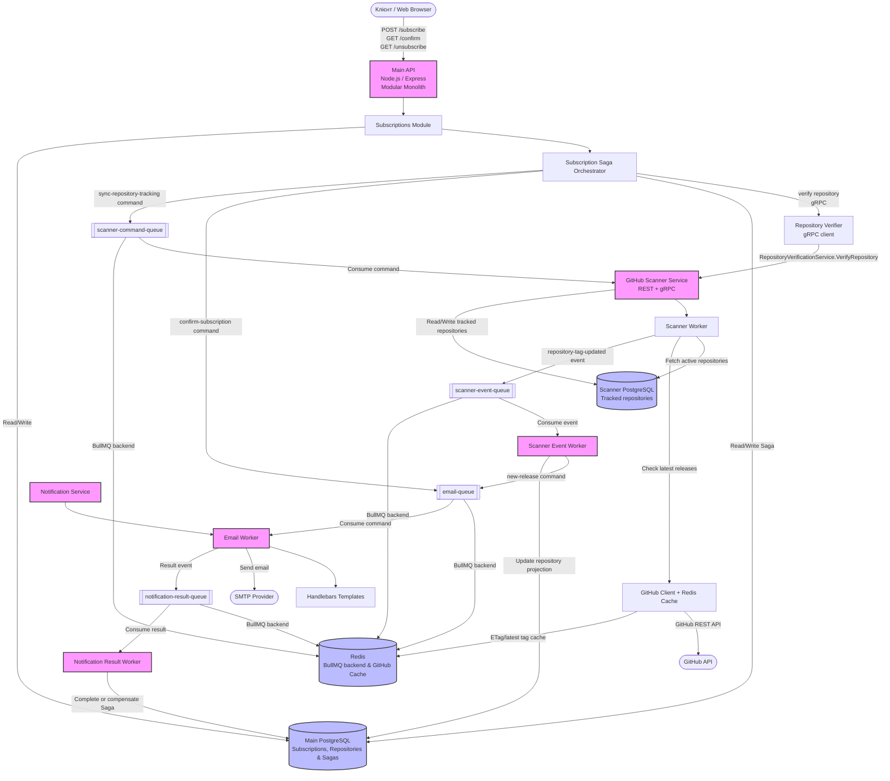
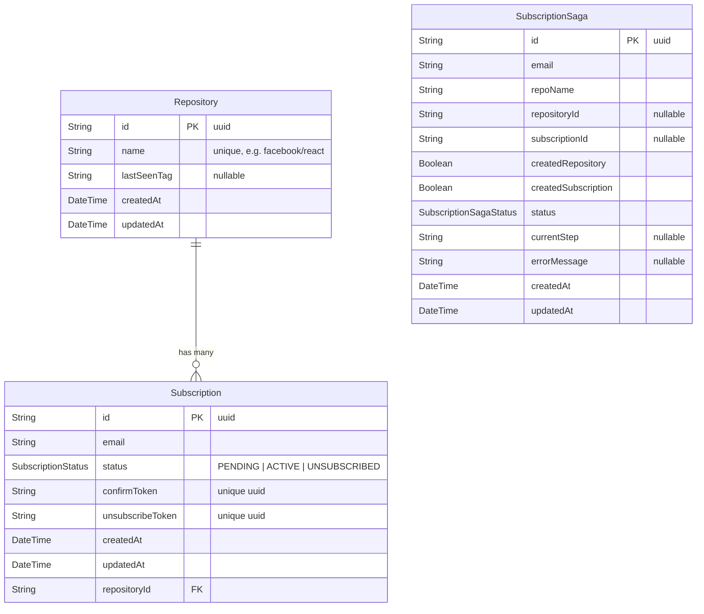

# System Design: GitHub Release Notification API

## 1. Вимоги системи

### Функціональні вимоги

- Користувачі можуть підписатися на оновлення конкретного відкритого GitHub-репозиторію, наприклад `facebook/react`.
- Система підтверджує email через унікальний токен, щоб запобігти небажаним підпискам.
- Користувач може відписатися через посилання в листі.
- Система періодично перевіряє нові релізи та надсилає email активним підписникам.

### Нефункціональні вимоги

- **Надійність:** Жодне сповіщення про реліз не має бути втрачено.
- **Швидкодія API:** subscribe/unsubscribe не очікують SMTP-відправлення; цільова latency API — менше 200 ms, окрім зовнішньої перевірки GitHub.
- **Масштабованість:** Можливість легкого горизонтального масштабування воркерів розсилки незалежно від Main API.

### Обмеження

- **GitHub API Rate Limits:** 60 запитів/годину без токена або 5000 запитів/годину з токеном.
- PostgreSQL, Redis/BullMQ і SMTP не можуть бути учасниками однієї атомарної транзакції.

---

## 2. Оцінка навантаження

Оцінка базується на 10 000 активних підписок і 1 000 унікальних репозиторіїв.

- **API:** приблизно 100–200 запитів на день.
- **GitHub API:** за сканування кожні 10 хвилин — до 144 000 запитів на день (`1000 × 6 × 24`). Умовні запити з ETag і відповіддю `304 Not Modified` зменшують фактичне споживання rate limit.
- **Email:** приблизно 200–500 листів на день.
- **PostgreSQL:** 10 000 записів `Subscription` по ~200 B займають орієнтовно 2 MB без урахування індексів.
- **Redis:** кеш GitHub API орієнтовно займає 10–20 MB; BullMQ також використовує Redis для зберігання jobs.

---

## 3. High-Level архітектура

Система побудована як **модульний моноліт + окремі Notification Service та GitHub Scanner Service**.

Main API містить такі модулі:

- **Subscriptions Module** — створення, підтвердження, скасування та перегляд підписок.
- **Repositories Module** — робота з відстежуваними репозиторіями.
- **Scanner Module** — синхронізація tracked repositories зі scanner service та обробка scanner events.
- **GitHub Module** — порт repository verification, який реалізується infrastructure adapter-ом.
- **Saga Module** — координація асинхронного subscription flow і компенсація.
- **Infrastructure Layer** — PostgreSQL, Redis, логування, метрики та Swagger.

Notification Service є власником email-домену: шаблонів Handlebars, SMTP-інтеграції та обробки email jobs.

GitHub Scanner Service є власником інтеграції з GitHub API для перевірки репозиторіїв і періодичного сканування релізів. Main API звертається до нього через gRPC для синхронної repository verification під час створення підписки. REST implementation у scanner service збережена для HTTP-сумісного доступу, health checks і ручної діагностики, але основний service-to-service шлях за замовчуванням — gRPC.



### Межа між модулями та мікросервісом

Main API не має прямої залежності від Nodemailer, SMTP або email-шаблонів. Він створює BullMQ jobs:

```txt
confirm-subscription
new-release
```

Notification Service не модифікує `Subscription`, `Repository` або `SubscriptionSaga` напряму. Результат confirmation email він повертає лише через спільні contracts і `notification-result-queue`.

GitHub Scanner Service не створює підписки напряму. Для subscription flow він повертає лише результат repository verification. Main API сам вирішує, як перетворити gRPC статус scanner-а у HTTP відповідь клієнту.

---

## 4. Оркестрована Saga підписки

Створення підписки є розподіленою асинхронною операцією. Main API виконує роль Saga Orchestrator і зберігає lifecycle процесу в `SubscriptionSaga`.

```txt
Client
  -> POST /api/subscribe

Main API
  -> validates repository through GitHub Scanner Service over gRPC
  -> creates SubscriptionSaga and PENDING Subscription in PostgreSQL
  -> publishes confirm-subscription command to email-queue
  -> returns 202 Accepted

Notification Service / EmailWorker
  -> consumes command
  -> sends confirmation email through SMTP
  -> publishes confirmation-email-sent or confirmation-email-failed result event

Main API / NotificationResultWorker
  -> sent: marks Saga as COMPLETED
  -> failed: compensates local changes and marks Saga as COMPENSATED
```

`COMPLETED` означає, що SMTP-провайдер прийняв confirmation email, а не те, що користувач уже підтвердив підписку. Після завершення Saga підписка лишається `PENDING` і переходить у `ACTIVE` лише після використання confirmation link.

| `SubscriptionSaga.status` | Значення                                     |
| ------------------------- | -------------------------------------------- |
| `STARTED`                 | Saga створена.                               |
| `SUBSCRIPTION_CREATED`    | `Repository` та `Subscription` підготовлені. |
| `EMAIL_SEND_REQUESTED`    | Відправлення confirmation email запитано.    |
| `COMPLETED`               | SMTP-провайдер прийняв confirmation email.   |
| `COMPENSATING`            | Виконується відновлення локальних змін.      |
| `COMPENSATED`             | Компенсацію завершено.                       |

### Compensation

Якщо confirmation email остаточно не відправлено, `NotificationResultWorker` запускає compensation:

- для нової підписки видаляє `PENDING Subscription`;
- якщо repository був створений цією Saga і більше не має підписок, видаляє його;
- для повторної підписки повертає статус із `PENDING` до `UNSUBSCRIBED`.

### Retries та ідемпотентність

Email jobs і result jobs мають до трьох спроб з exponential backoff. Тимчасова SMTP-помилка не запускає компенсацію: `confirmation-email-failed` публікується лише під час останньої невдалої спроби.

Після успішної передачі confirmation email SMTP-провайдеру Email Worker зберігає BullMQ progress `email-sent`. Якщо публікація success result event тимчасово не вдасться, наступна спроба не надсилатиме лист повторно, а повторить лише result publishing. Result jobs мають детермінований ID `${event.type}-${event.sagaId}`, що зменшує кількість дублікатів result events.

### Відомі обмеження

Поточна реалізація не використовує transactional outbox. Тому існують failure windows між комітом PostgreSQL і додаванням email job у BullMQ, а також під час публікації фінального failure result event. Вони можуть залишити Saga у проміжному стані без автоматичного продовження.

Між успішною SMTP-відправкою та збереженням progress також можливе аварійне завершення процесу; у такому разі retry потенційно надішле email повторно. Для production-рівня гарантій потрібні transactional outbox з dispatcher-ом або процес відновлення Saga у проміжних станах, а також idempotency key на рівні email-провайдера. Деталі рішення й компромісів зафіксовані в [ADR-006](adr/0006-use-orchestrated-saga-for-subscription-flow.md).

---

## 5. Детальний дизайн компонентів

### 5.1. API Service

- **Стек:** Node.js, Express, Zod.
- `POST /api/subscribe` запускає Saga та повертає `202 Accepted` після постановки confirmation email command у BullMQ.
- `GET /api/confirm/:token` переводить `Subscription` із `PENDING` у `ACTIVE`.
- `GET /api/unsubscribe/:token` переводить підписку в `UNSUBSCRIBED`.
- `GET /api/subscriptions?email=<email>` повертає підписки користувача; endpoint захищений заголовком `x-api-key`.

### 5.2. GitHub Scanner

GitHub Scanner Service має власну таблицю `TrackedRepository` і запускає scheduled scan через `node-cron`.

- Main API публікує `sync-repository-tracking` command у `scanner-command-queue`, коли repository має бути активований або деактивований у scanner service.
- GitHub Scanner Service споживає command і синхронізує власну projection таблицю `TrackedRepository`.
- Scanner періодично отримує активні tracked repositories зі своєї БД.
- Для кожного repository він викликає `GET /repos/{owner}/{repo}/releases/latest`, порівнює tag із `TrackedRepository.lastSeenTag` і використовує Redis для ETag/latest tag кешування.
- За нового релізу scanner service публікує `repository-tag-updated` event у `scanner-event-queue`.
- Main API споживає scanner event, оновлює свою repository projection і створює `new-release` jobs для активних підписників.

### 5.3. Repository verification через gRPC

Під час `POST /api/subscribe` Main API синхронно перевіряє, що GitHub repository існує і доступний. За замовчуванням ця перевірка виконується через gRPC:

```txt
Main API
  -> GrpcRepositoryVerifier
  -> RepositoryVerificationService.VerifyRepository
  -> GitHub Scanner Service
  -> GitHub API
```

REST implementation у GitHub Scanner Service збережена, але Main API використовує `GrpcRepositoryVerifier` як основний adapter для repository verification.

`.proto` файл є source of truth для RPC контракту:

```txt
proto/github/notifier/scanner/v1/repository_verification.proto
```

Buf відповідає за lint/generation:

```txt
buf lint
buf generate
```

Generated TypeScript contracts зберігаються в `packages/scanner-contracts/src/generated` і використовуються обома сторонами:

- Main API імпортує `RepositoryVerificationServiceClient`;
- GitHub Scanner Service реалізує `RepositoryVerificationServiceServer`.

Кожен RPC виклик має deadline через `CallOptions.deadline`; timeout задається `SCANNER_SERVICE_GRPC_TIMEOUT_MS`. Якщо scanner service не відповідає вчасно, Main API повертає клієнту HTTP `504`.

GitHub Scanner Service перетворює domain errors у gRPC statuses, а Main API перетворює gRPC statuses у HTTP statuses:

| Scanner gRPC status  | Main API HTTP status |
| -------------------- | -------------------- |
| `INVALID_ARGUMENT`   | `400`                |
| `PERMISSION_DENIED`  | `403`                |
| `NOT_FOUND`          | `404`                |
| `RESOURCE_EXHAUSTED` | `429`                |
| `DEADLINE_EXCEEDED`  | `504`                |
| `UNAVAILABLE`        | `503`                |
| `CANCELLED`          | `503`                |
| інші статуси         | `502`                |

Деталі рішення зафіксовані в [ADR-007](adr/0007-use-grpc-for-repository-verification.md).

### 5.4. Черги та workers

BullMQ використовує Redis як backend для service-to-service черг:

- `email-queue` передає `confirm-subscription` і `new-release` commands із Main API до Notification Service;
- `notification-result-queue` передає result events для confirmation email із Notification Service до Main API.
- `scanner-command-queue` передає commands із Main API до GitHub Scanner Service для синхронізації tracked repositories;
- `scanner-event-queue` передає repository scan events із GitHub Scanner Service до Main API.

Email Worker ізольовує SMTP-відправлення від API і дозволяє незалежно масштабувати розсилку. Notification Result Worker завершує або компенсує Saga на підставі result event.

---

## 6. Схема бази даних

`Repository` зберігає унікальні GitHub-репозиторії та стан моніторингу. `Subscription` зберігає email і статус підписки. `SubscriptionSaga` зберігає стан розподіленої операції створення підписки.



**Enum `SubscriptionStatus`:**

| Значення       | Опис                                               |
| -------------- | -------------------------------------------------- |
| `PENDING`      | Підписка створена, але email ще не підтверджено.   |
| `ACTIVE`       | Email підтверджено; користувач отримує сповіщення. |
| `UNSUBSCRIBED` | Користувач відписався.                             |

**Індекси:**

- `@@unique([email, repositoryId])` — гарантує, що користувач не може підписатися на один і той самий репозиторій двічі.
- Унікальні індекси на `confirmToken` та `unsubscribeToken` підтримують відповідні user flows.
- Індекси `SubscriptionSaga.status` та `SubscriptionSaga.subscriptionId` підтримують спостереження й обробку Saga.
